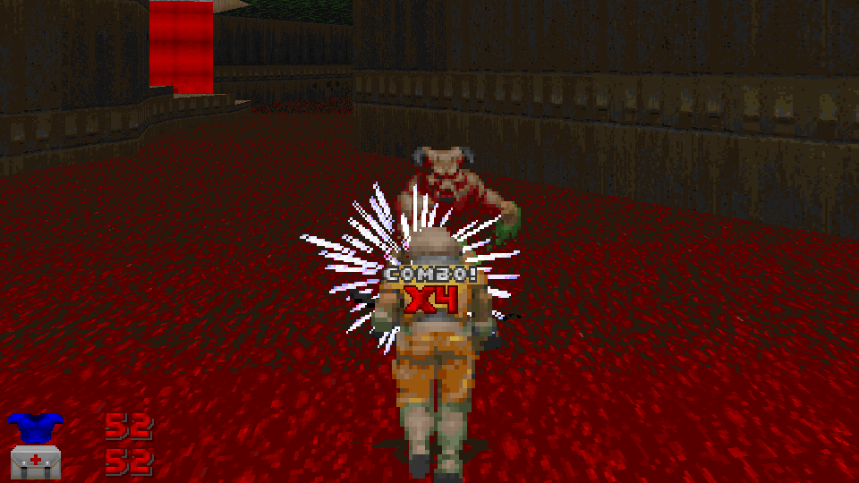

# ParryMe

ParryMe is a universal parrying mod for GZDoom.

Before getting hit by *anything* that isn't self-inflicted or environmental,
you can parry within a 4-tic (`sv_parryMe_time`) window to avoid getting any
damage by pressing Forward. You can only parry again once the time window has
expired.

This mod should be multiplayer-compatible, but no extensive testing has been
done for it yet. It'd probably be really fun to use in deathmatch.

*This is a ZScript rewrite of Mawosic's
[Parry-Mod](https://forum.zdoom.org/viewtopic.php?t=71830). All credits go to
them.*